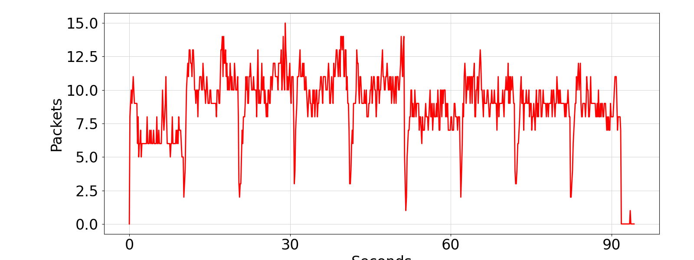
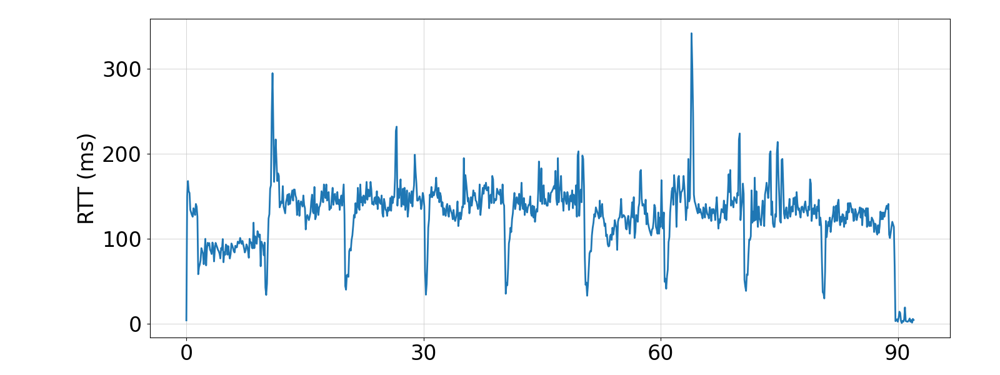
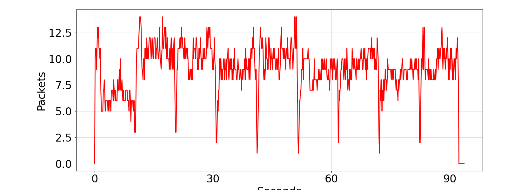
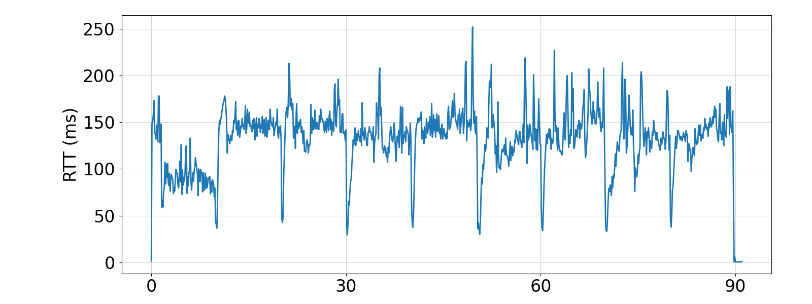

# Relatório Parte 3

## 1. Qual é o tempo médio de busca da página da web e seu desvio padrão quando q=20 e q=100?

| Tamanho do Buffer (q) | Tempo Médio (s) | Desvio Padrão (s) |
|-----------------------|-----------------|--------------------|
| 100                   | 0.259673        | 0.092183          |
| 20                    | 0.279986        | 0.075858          |

## 2. Compare o tempo de busca da página web entre q=20 e q=100 da Parte 3. Qual tamanho da fila fornece um tempo de busca menor? Como isso é diferente da Parte 2?
Reno usa uma abordagem baseada na perda para detectar congestionamento. Ele aumenta a janela de congestionamento linearmente até detectar uma perda. Assim, Um buffer maior (q=100) leva a maior retenção de pacotes, resultando em mais atraso no RTT efetivo devido à latência adicional causada pela fila. 
Porém o BBR é menos sensível ao tamanho do buffer porque não tenta preencher a fila, mas sim transmitir com base na estimativa da largura de banda disponível. Então ambos tempos médios são muito próximos (q=100 e q=20). O tempo de fila do q=100 é ligeiramente menor porque como o BBR consegue lidar com buffers maiores sem a degradação de desempenho isso pode ajudar a aumentar o throughput.

## 3. Você vê a diferença nos gráficos de tamanho de fila da Parte 2 e da Parte 3? Dê uma breve explicação para o resultado que você vê.

Podemos ver que, diferente dos gráficos para tamanho de fila do Reno, o gráfico de tamanho de fila BBR para q=20 e q=100 são bem similares pela questão da insensibilidade ao tamanho da fila como explicado na questão 2. No Reno a fila de pacotes cresce de maneira quase linear até ficar cheia (mais visível em q=100). Porém no BBR a fila nunca passa de mais de 15 pacotes.

## 4. Você acha que resolvemos o problema do bufferbloat? Explique seu raciocínio.

O BBR já é um grande passo na direção de resolver o problema do bufferbloat como vemos nos resultados do experimento e já oferece uma solução razoável e prática. Porém, o problema de bufferbloat por completo não pode ser resolvido apenas utilizando o BBR pois no contexto de redes maiores a situação é muito mais complexa. Existem várias críticas ao BBR como sua agressivadade já que ele se baseia em alcançar maior banda possível com menor RTT ele poderia causar problemas em redes grande que utilizam outros algoritmos baseados em perdas como o Reno.
